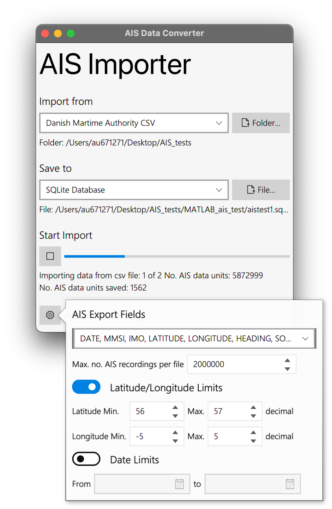

# AISdecode

## Introduction
AISdecode is a simple app to convert one type of AIS data to another. It is generally useful for mining large datasets of raw AIS data e.g. saved as .csv or .nmea files and saving relevent data (e.g. between certain times or within a geographic area) to more user readable format such as an sqlite database or MATLAB files. AISdecode was desinged to be extensible i.e. it can implement as many input and output data types as are needed. 

## Basic usage

The AISDecode app is divided into four sections

### Import from
The drop down menu allows users to select the data type ot import. Then select _Folder..._ or _File..._ (depending on the import type) to select the location of the data. 

### Save to
The drop down menu allows users to select how the data is saved. Select _Folder..._ or _File..._ (depending on the save method) to select the location that the data will be saved to. 

### Start Import
Select the "play" button to start importing the data. A progress bar will appear showing the number of AIS data units processed and how many have been saved. 

  

_Screenshot of the AISDecode app with the advanced settings pane open_

### Advanced settings (cog)
The advanced settings allow users to select the type of data fields, time periods and a geographic area to save. 

_AIS Export Fields_ allows users to select the fields to save - by default all fields are selected but reducing fields will reduce the file size of some export data types. 

_Latitude/Longtide limits_ allows the user to select a rectangular geogrphic limits for the AIS data. Any AIS data with a latitude and longitude outside the area will not be saved. By default the Latiude/Longitude limits are disabled (using the toggle button). The latitude and longitude limits are eneterd in decimal format e.g. 57.1648794. 

_Data Limits_ allows the user to select a time period in which to save AIS data. Any AIS data units outside the time limits will be discarded. The date limits have a resolution of a day (i.e. it is not possible to select a specific time within a day). Bt default the date limits are disabled but can be enabled with the progress button. 

## Current data types

There are currently two input and output data types. New types can easily be added to the program; if this is of interest please get in touch. 

### Import data types 

#### Danish coastguard .csv files

#### AIS NMEA files

### Ouput data types

#### SQLite

#### MATLAB files

